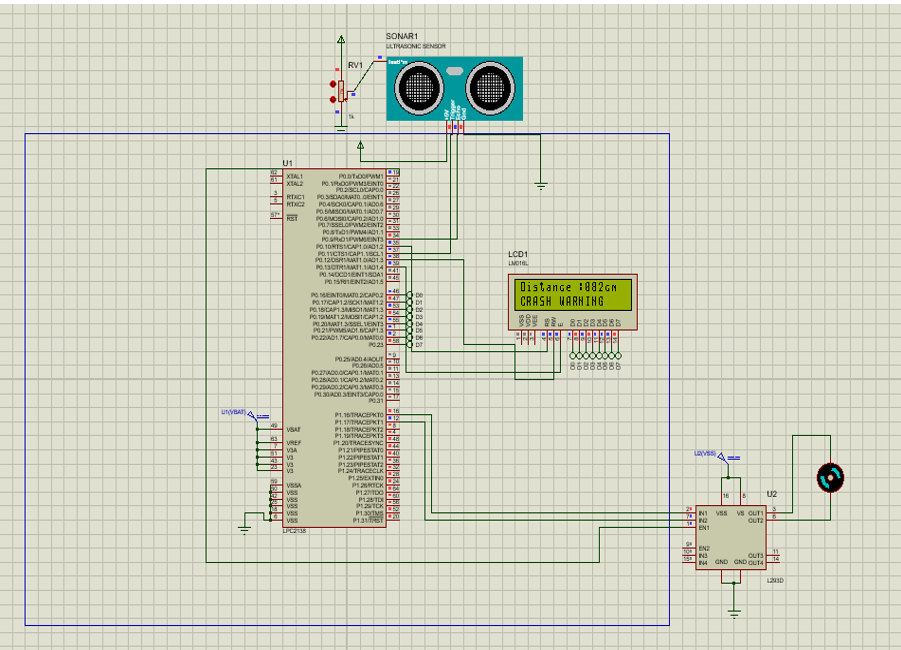

# 🚗 Automatic Braking System using LPC2138

This project implements an **Automatic Braking System** using the **LPC2138 ARM7 microcontroller**. It uses an **HC-SR04 ultrasonic sensor** to detect obstacles and applies **PWM-based motor control** for safe, real-time braking.

### 💡 Key Features:
- Distance-based braking logic (Safe, Warning, Danger zones)
- Emergency stop in critical conditions
- Real-time LCD feedback
- PWM motor speed control using L298 driver

### 🧠 How It Works:
The system continuously monitors the distance to obstacles. Based on this, it adjusts the motor speed:
- **>100 cm**: Full speed
- **50–100 cm**: Speed decreases as obstacle nears
- **<50 cm**: Immediate stop with crash warning

### 🛠 Components Used:
- LPC2138 (ARM7)
- HC-SR04 Ultrasonic Sensor
- L298 Motor Driver
- DC Motor
- 16x2 LCD Display

### 🔧 Applications:
- Autonomous Vehicles
- Robotics Safety Systems
- Smart Parking & AGVs

### 🧪 Simulation:
Proteus simulation screenshot available below.

---

> **Note**: Header files like `Timer.h`, `Ultrasonic.h`, and `LCD.h` are assumed to include initialization and utility functions and can be added in future commits.
